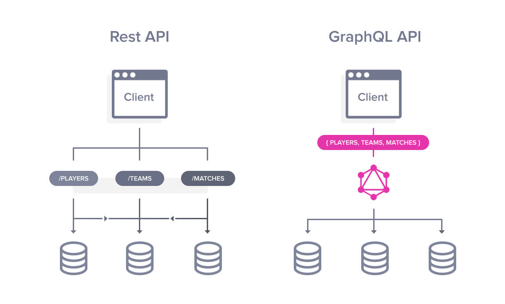

# A **very** basic GraphQL server with Express

[](https://circleci.com/gh/krynv/graphql-express-server/tree/master)

A very basic example of how to create a GraphQL server with Express.

This project uses the `esm` package to utilise the latest ES6 syntax. 

You can test the application by sending a `hello` GraphQL query, like below:

```graphql
{
    hello
}
```

You should expect a response of:

```graphql
{
  "data": {
    "hello": "Hello world!"
  }
}
```

## How GraphQL Works



## Run the application

Install dependencies:

    npm i

Start server: 

    npm start

Access GraphiQL at:
http://localhost:1337/api


### Lazystart:

    git clone git@github.com:krynv/graphql-express-server && npm i && npm start